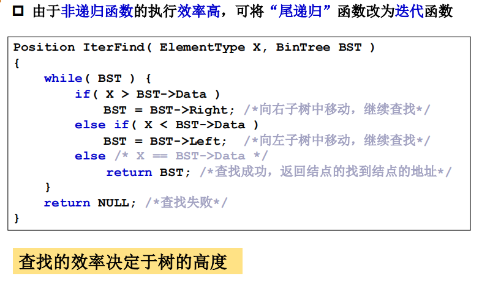

# Lecture-8 二叉搜索树

二叉搜索树（BST，Binary Search Tree），也称二叉排序树或二叉查找树。
二叉搜索树：一棵二叉树，可以为空；如果不为空，满足以下性质：  
1. 非空左子树的所有键值小于其根结点的键值。  
2. 非空右子树的所有键值大于其根结点的键值。  
3. 左、右子树都是二叉搜索树。  
4. 这意味着该树所有的元素可以用某种统一的方式排序。

## 二叉搜索树的查找操作：Find

- 查找从根结点开始，如果树为空，返回 NULL

- 若搜索树非空，则根结点关键字和 X 进行比较，并进行不同处理：
    1.若X小于根结点键值，只需在左子树中继续搜索；
    2.如果X大于根结点的键值，在右子树中进行继续搜索；
    3.若两者比较结果是相等，搜索完成，返回指向此结点的指针。

- 由于非递归函数的执行效率高，可将“尾递归”函数改为迭代函数。

### 查找最大和最小元素

- 最大元素一定是在树的最右分枝的端结点上
- 最小元素一定是在树的最左分枝的端结点上

## 二叉搜索树的插入

## 二叉搜索树的删除

- 是否是同一棵二叉搜索树，两个序列是否对应相同搜索树的判别