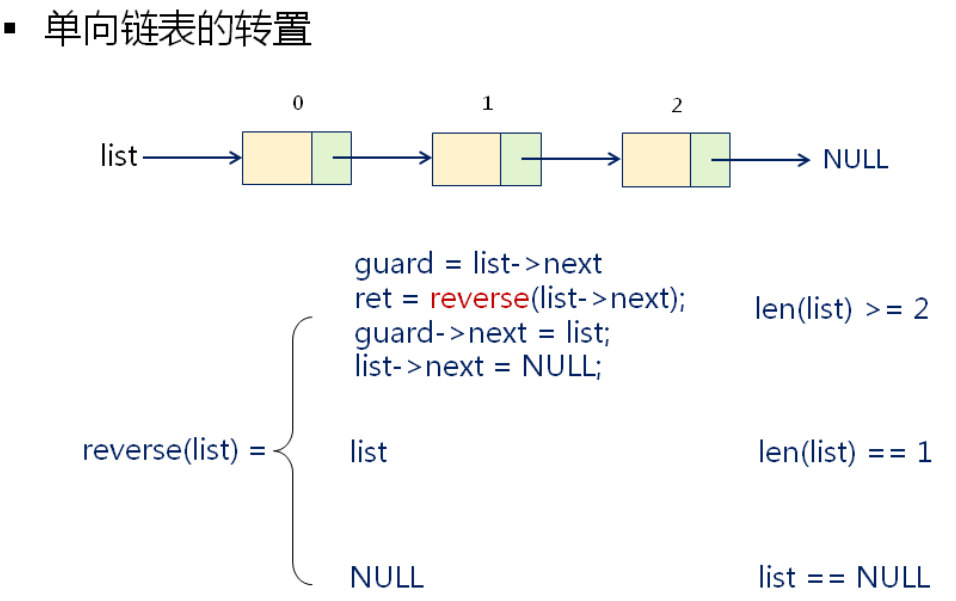
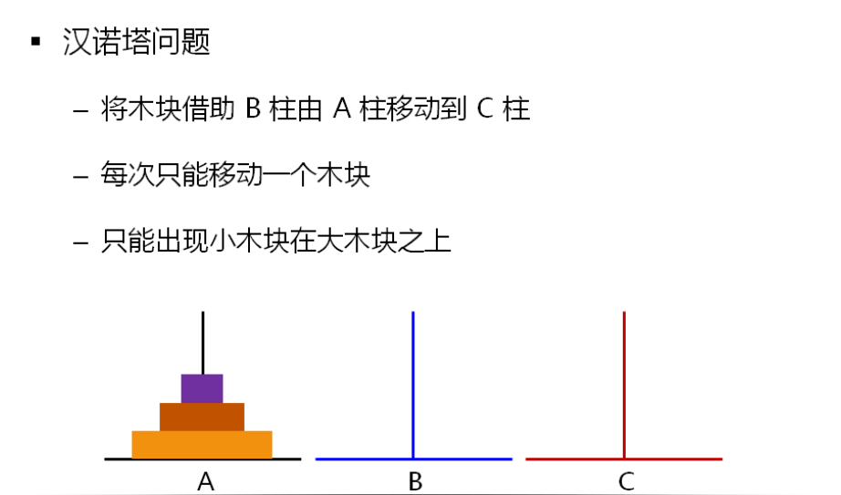
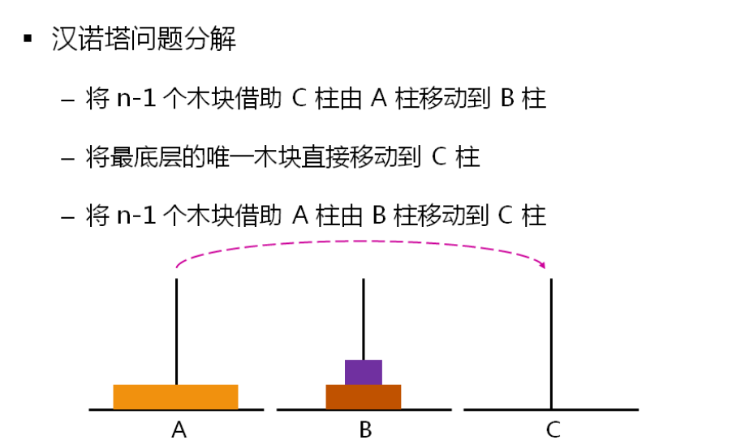
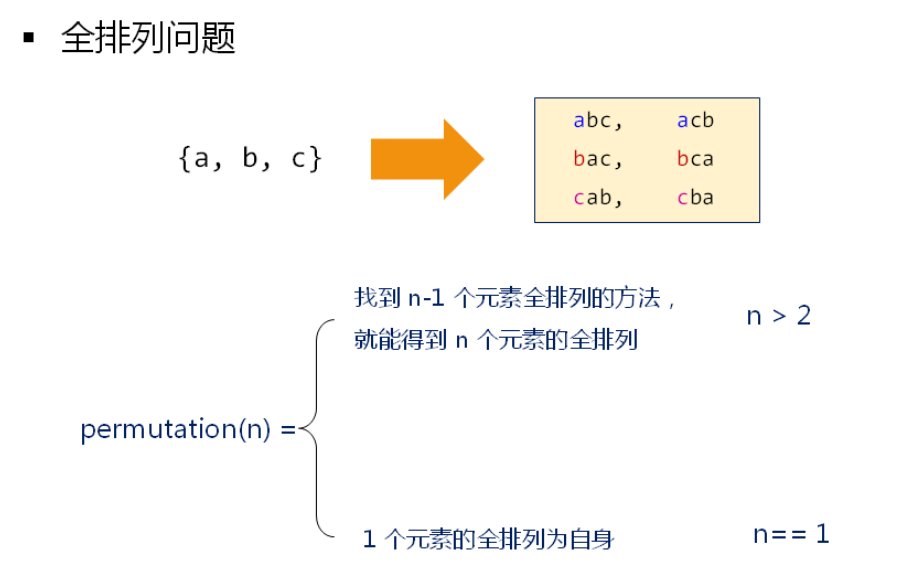
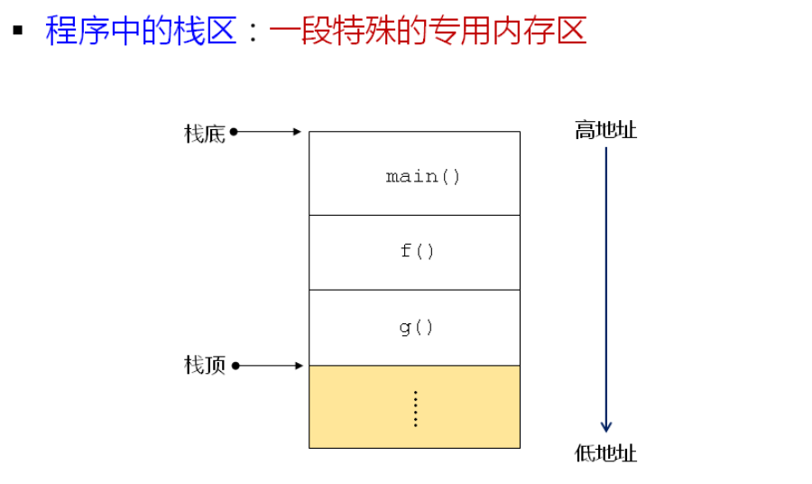
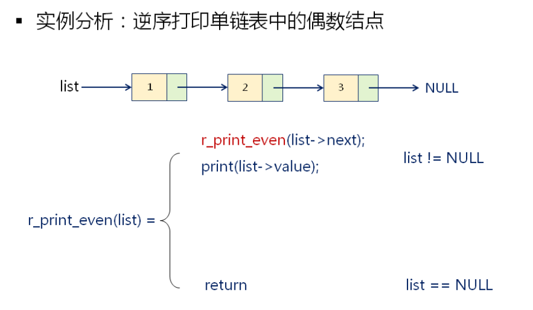

# 递归的思想与应用

- [递归代码示例](../eclipse/DataStructuresCode/src/Project_01_recursive_function.cpp)

## 1 递归是数学上分而治之的思想

- 将原问题分解为规模较小的问题进行处理
    - 分解后的问题与原问题类型完全相同，但规模较小
    - 通过小规模问题的解，能够轻易求得原问题的解
- 问题的分解是有限的（递归不能无限进行）
    - 当边界条件不满足时，分解问题（递归继续进行）
    - 当边界条件满足时，直接求解（递归结束）

### 1.1 递归模型的一般表示方法


## 2 递归在程序设计中的应用

- 递归函数
  - 函数体中存在自我调用的函数
  - 递归函数`必须有递归出口`（边界条件）
  - 函数的`无限递归将导致程序崩溃`

### 2.1 递归求和


- 代码实现：

```c
unsigned int sum(int n) {
    if (n > 1)
        return n + sum(n - 1);
    else if (n == 1) {
        return 1;
    }
}
```

### 2.2 斐波那契数列


- 代码实现：

```c
unsigned int fac(int n) {
    if (n >= 3) {
        return fac(n - 1) + fac(n - 2);
    }

    if (n == 2)
        return 1;

    if (n == 1)
        return 1;
}
```
### 2.3 用递归的方法编写函数求字符串长度


- 代码实现：

```c
unsigned int get_strlen(char *s) {
    if (*s != '\0')
        return 1 + get_strlen(s + 1);
    if (*s == '\0')
        return 0;
}
```
### 2.4 单向链表的转置



- 代码实现：

```c
List reverse(List list) {
    if ((list == NULL || list->Next == NULL)) {
        return list;
    } else {
        List guard = list->Next;
        List ret = reverse(list->Next);
        guard->Next = list;
        list->Next = NULL;
        return ret;
    }
}
```

### 2.5 单向排序链表的合并


- 代码实现：

```c
List List_Merge(List L1, List L2) {
    if (L1 == NULL) {
        return L2;
    } else if (L2 == NULL) {
        return L1;
    } else if (L1->Data <= L2->Data) {
        List list_1 = L1->Next;
        List list = List_Merge(list_1, L2);
        L1->Next = list;
        return L1;
    } else {
        List list_2 = L2->Next;
        List list = List_Merge(list_2, L1);
        L2->Next = list;
        return L2;
    }
}
```

### 2.6 汉诺塔问题





- 代码实现：

```c
//汉诺塔问题：从 a 到 c, b 为中转站
void HanoiTower(int n, char a, char b, char c) {
    if (n == 1) {
        cout << a << "-->" << c << endl;
    } else {
        HanoiTower(n - 1, a, c, b);
        HanoiTower(1, a, b, c);
        HanoiTower(n - 1, b, a, c);
    }
}
```

### 2.7 全排列问题



- 代码实现：

```c
void permutation(char *s, char *e) {
    if (*s == '\0') {
        cout << e << endl;
    } else {
        int len = strlen(s);

        for (int i = 0; i < len; i++) {
            if ((i == 0) || (s[0] != s[i])) {
                swap(s[0], s[i]);
                permutation(s + 1, e);
                swap(s[0], s[i]);
            }
        }
    }
}
```

### 2.8 逆序打印单链表中的偶数结点
#### 2.8.1 函数的调用过程回顾
- 程序运行后有一个特殊的内存区供函数调用使用
    - 用于保存函数中的实参，局部变量，临时变量等
    - 从起始地址开始往一个方向增长（如：高地址 -> 低地址）
    - 有一个专用的指针标识当前已经使用的内存的“顶部”，及栈顶指针
- 对函数栈使用的思考
    - 随着内存的使用或者释放，指针向下或者向上移动
    - 与特定函数调用相关的数据都存在各自函数的栈中，当 g() 函数返回，空间被释放后回到 f() 所在的栈，这个时候 f() 函数的栈数据没有变化。因此我们可以利用函数栈保存信息的特性来逆序递归的解决下面的问题。
    - 回溯算法的本质就是在栈上面作标记，以便于回退的时候使用。



#### 2.8.2 逆序打印单链表分析



- 题目分析

  - 递归出口是当 list 指向空的时候，函数直接返回
  - 当 list 不为空的时候递归调用反转打印函数，打印 list->next 的逆序，逐步减小问题规模
  - 当最终 list == NULL 的时候开始返回，利用栈中存储的信息来一步一步打印出链表中元素的值

- 代码实现：
```c
void list_attach(int data,List *pRear) {
    List P;

    P = (List) malloc(sizeof(struct Node));
    P->Data = data;
    P->Next = NULL;

    (*pRear)->Next = P; //让尾节点的指针指向新的节点
    *pRear = P;         //更新尾指针指向的位置
}

List create_list(int n) {

    List P, Rear, t;

    P = (List) malloc(sizeof(struct Node));
    P->Next = NULL;
    Rear = P;

    for (int i = 0; i < n; i++) {
        list_attach(i, &Rear);
    }

    t = P;
    P = P->Next;
    free(t);

    return P;
}

//递归实现的反向输出链表中的偶数
void r_print_even(List list) {
    if (list != NULL) {
        r_print_even(list->Next);

        if ((list->Data % 2) == 0) {
            cout << list->Data << endl;
        }
    }
}
```

### 2.9 八皇后问题


## 3 总结

- 递归是一种将问题`分而治之`的思想
- 用递归解决问题`首先要建立递归的模型`
- 递归解法`必须要有边界条件，否则无解`
- `不要陷入递归函数的执行细节`，学会通过代码描述递归问题，我们需要了解的是递归函数背后的递归模型，只要掌握了递归模型，递归函数仅仅是递归模型的描述而已。

