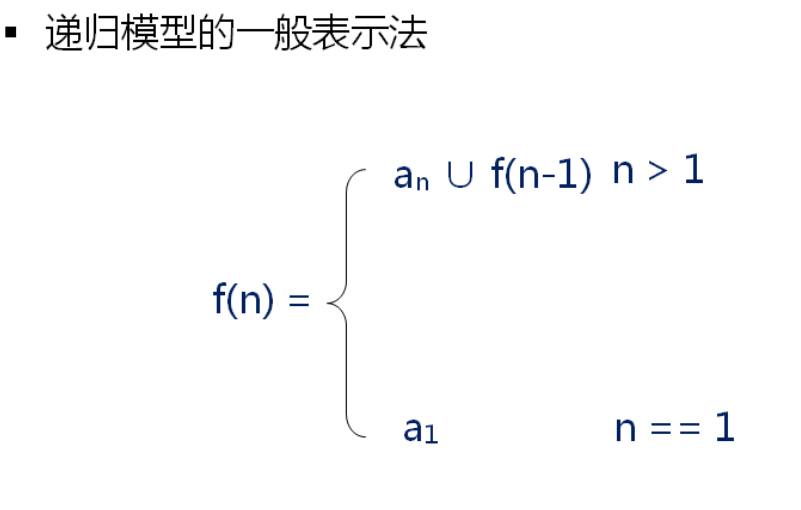
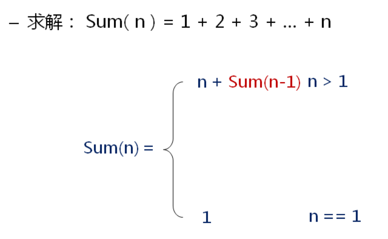
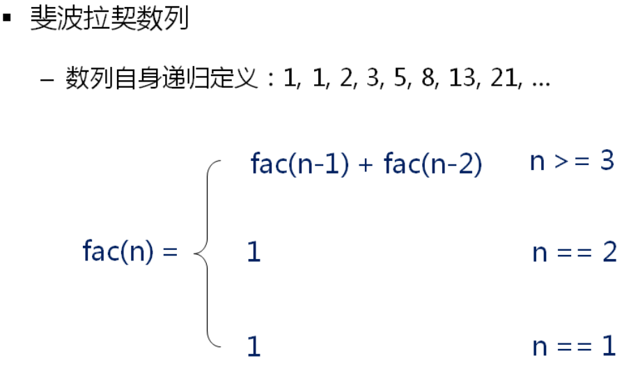
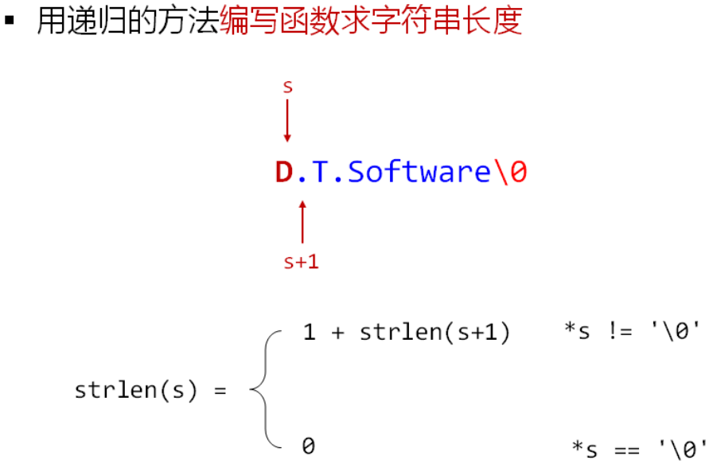

# 递归的思想与应用

## 递归是数学上分而治之的思想

- 将原问题分解为规模较小的问题进行处理
    - 分解后的问题与原问题类型完全相同，但规模较小
    - 通过小规模问题的解，能够轻易求得原问题的解
- 问题的分解是有限的（递归不能无限进行）
    - 当边界条件不满足时，分解问题（递归继续进行）
    - 当边界条件满足时，直接求解（递归结束）

### 递归模型的一般表示方法如下：




## 递归在程序设计中的应用

- 递归函数
  - 函数体中存在自我调用的函数
  - 递归函数`必须有递归出口`（边界条件）
  - 函数的`无限递归将导致程序崩溃`

### 递归求和



- 代码实现：

```
unsigned int sum(int n) {
	if (n > 1)
		return n + sum(n - 1);
	else if (n == 1) {
		return 1;
	}
}
```

### 斐波那契数列



- 代码实现：

```
unsigned int fac(int n) {
	if (n >= 3) {
		return fac(n - 1) + fac(n - 2);
	}

	if (n == 2)
		return 1;

	if (n == 1)
		return 1;
}
```
### 用递归的方法编写函数求字符串长度

###

- 代码实现：

```
unsigned int get_strlen(char *s){
	if(*s != '\0')
		return 1 + get_strlen(s + 1);
	if(*s == '\0')
		return 0;
}
```
## 小结

- 递归是一种将问题`分而治之`的思想
- 用递归解决问题`首先要建立递归的模型`
- 递归解法`必须要有边界条件，否则无解`
- `不要陷入递归函数的执行细节`，学会通过代码描述递归问题，我们需要了解的是递归函数背后的递归模型，只要掌握了递归模型，递归函数仅仅是递归模型的描述而已。